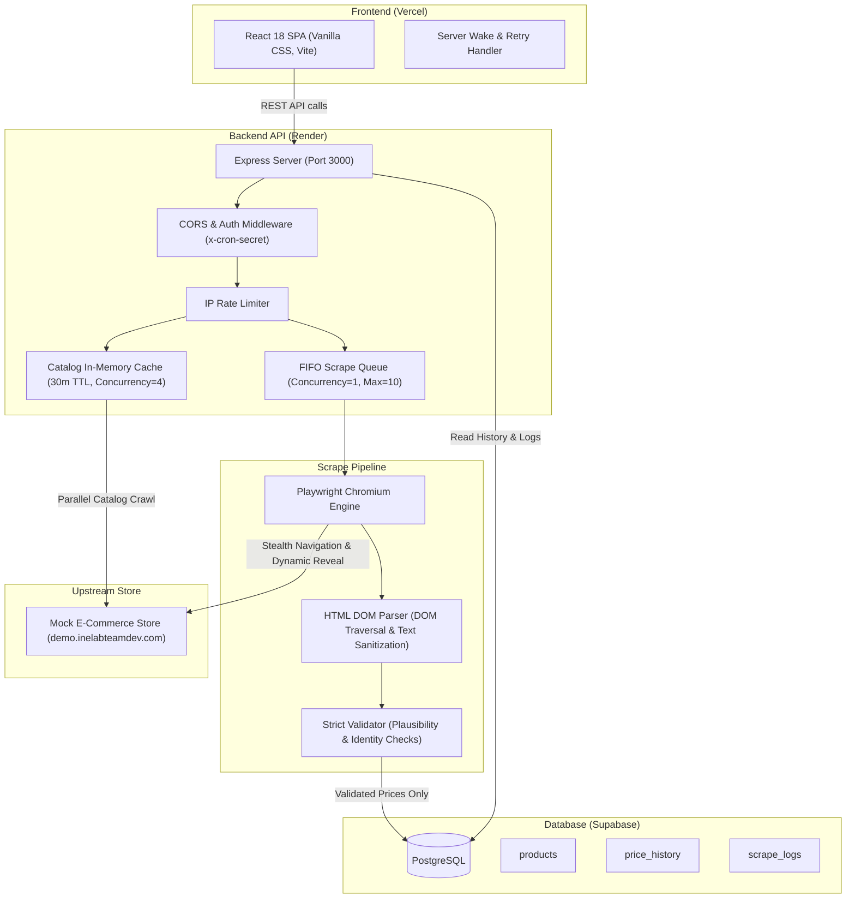
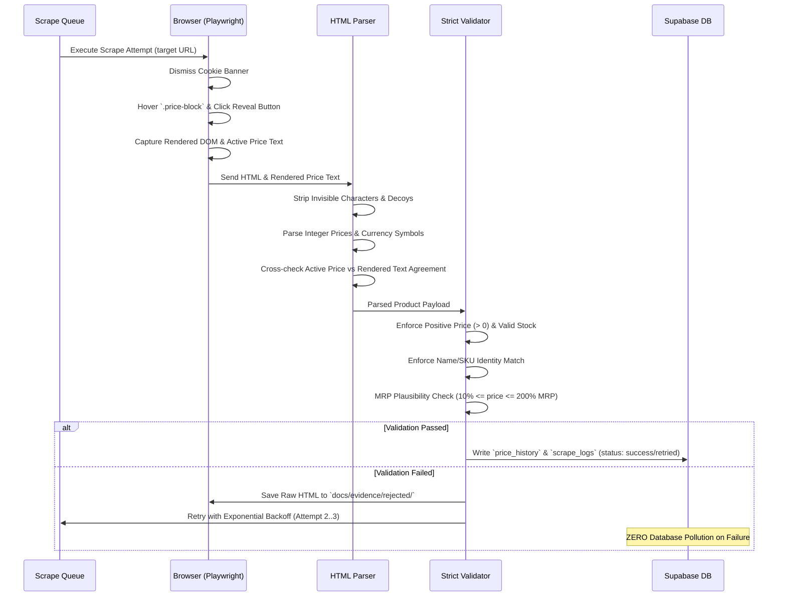

# Product Price Tracker

An automated price and stock tracking service and dashboard for e-commerce products, featuring resilient web scraping, real-time analytics, and honest execution telemetry.

- **Live Frontend**: [<VERCEL_URL>](https://price-tracker-seven-dun.vercel.app)
- **Live Backend API**: [<RENDER_URL>](https://price-tracker-h20m.onrender.com)

---

## Architecture Overview



---

## Setup & Local Development

### Prerequisites

- Node.js 20+ (recommended v22 LTS)
- npm 10+
- Playwright Chromium (`npx playwright install chromium`)

### 1. Repository Installation

Clone the repository and install dependencies from the monorepo root:

```bash
git clone https://github.com/GitH-Priyanshu/price-tracker.git
cd price-tracker
npm install
npx playwright install chromium
```

### 2. Environment Variables Configuration

#### Server (`server/.env`)

Create `server/.env` based on `server/.env.example`:

```ini
# Supabase PostgreSQL Database Credentials
SUPABASE_URL=https://your-project.supabase.co
SUPABASE_SERVICE_KEY=your-supabase-service-role-key

# Security & CORS
CRON_SECRET=your-secure-cron-secret
FRONTEND_ORIGIN=http://localhost:5173

# Server Settings
PORT=3000
NODE_ENV=development
STORE_BASE_URL=https://demo.inelabteamdev.com

# Scrape Engine Budgets & Concurrency
REQUEST_TIMEOUT_MS=12000
MAX_ATTEMPTS=3
SCRAPE_CONCURRENCY=1
DEDUPE_WINDOW_MINUTES=10
MAX_TRACKED_PRODUCTS=10
SCRAPE_QUEUE_LIMIT=10
```

#### Client (`client/.env`)

Create `client/.env` based on `client/.env.example`:

```ini
# In local development, leave empty or point to localhost:3000 (Vite proxy forwards /api)
VITE_API_URL=http://localhost:3000
```

### 3. Running Locally

Run server and client concurrently or in separate terminals:

```bash
# Terminal 1: Start Backend API (Port 3000)
npm --workspace=server run dev

# Terminal 2: Start Frontend Vite Server (Port 5173)
npm --workspace=client run dev
```

Visit `http://localhost:5173/` in your browser. (Hard refresh with `Ctrl + Shift + R` if browser cache is active).

---

## API Specification

All endpoints reside under the `/api` prefix and return JSON. Errors follow a consistent `{ "error": { "code": string, "message": string } }` envelope.

### Endpoint Summary Table

| Method   | Endpoint                    | Auth / Security | Rate Limit | Description                                                       |
| -------- | --------------------------- | --------------- | ---------- | ----------------------------------------------------------------- |
| `GET`    | `/api/health`               | Public          | None       | Liveness health check and server uptime                           |
| `GET`    | `/api/search?q={query}`     | Public          | 60 req/min | Search store catalog with multi-word matching & ID fallback       |
| `GET`    | `/api/search/stats`         | Public          | 60 req/min | Catalog cache telemetry (unique count, store total, partial flag) |
| `POST`   | `/api/products`             | Public          | None       | Track product by store ID or URL; enqueues initial scrape         |
| `GET`    | `/api/products`             | Public          | None       | List all active tracked products with latest price/stock          |
| `GET`    | `/api/products/:id`         | Public          | None       | Single tracked product details and latest verified price          |
| `DELETE` | `/api/products/:id`         | Public          | None       | Soft-deactivate a tracked product                                 |
| `GET`    | `/api/products/:id/history` | Public          | None       | Price history time series (`?range=24h\|7d\|30d\|all`)            |
| `GET`    | `/api/products/:id/logs`    | Public          | None       | Paginated scrape execution audit logs (`?limit=20&offset=0`)      |
| `POST`   | `/api/products/:id/refresh` | Public          | 60 req/min | On-demand price refresh with 5-minute cooldown per product        |
| `POST`   | `/api/products/:id/scrape`  | `x-cron-secret` | 20 req/min | Force-scrape product bypassing deduplication window               |
| `POST`   | `/api/cron/scrape`          | `x-cron-secret` | 20 req/min | Scheduled cron scrape cycle across all active tracked products    |

---

## Scrape Pipeline & Data Integrity

The scraping engine is designed for resilience against anti-bot challenges, dynamic layouts, and network instability.



### Key Safety Guarantees:

1. **Agreement Check**: Parses active price from HTML and validates against raw rendered element text in the same DOM state to defeat split-carrier rendering artifacts.
2. **MRP Plausibility**: Rejects prices below 10% or above 200% of MRP (protecting against zero-digit extraction bugs).
3. **FIFO Serialized Queue**: Scrapes run sequentially (`concurrency: 1`) to preserve RAM and avoid upstream rate limiting.
4. **Reserved Cron Slot**: When queue is at capacity (10), 1 slot is reserved exclusively for scheduled cron cycles.
5. **No DB Pollution**: Failed attempts never write speculative or zero-price rows to `price_history`.

---

## Cron vs Manual Refresh

| Feature               | Scheduled Cron (`/api/cron/scrape`)                       | Manual Refresh (`/api/products/:id/refresh`)                                    |
| --------------------- | --------------------------------------------------------- | ------------------------------------------------------------------------------- |
| **Trigger Mechanism** | External scheduler (Render cron, GitHub Actions, crontab) | User button click in dashboard                                                  |
| **Authentication**    | Protected by `x-cron-secret` header                       | Public (no secret exposed to client)                                            |
| **Cooldown / Dedupe** | Respects 10-minute duplicate window unless `force=true`   | Enforces strict 5-minute per-product cooldown (HTTP 429 with remaining seconds) |
| **Scope**             | Batch processes all active tracked products               | Single product queue job                                                        |
| **Queue Handling**    | Reserved queue slot ensures priority execution            | Capped under standard tracking queue limit                                      |

---

## Error Handling & Retry Strategy

Errors are classified into explicit operational categories:

- `NETWORK`: DNS failures, socket resets, connection drops (retried with exponential backoff).
- `TIMEOUT`: Exceeded page dwell budget (retried with jittered delay).
- `RATE_LIMITED`: Upstream HTTP 429 (respects `Retry-After` header or backoff).
- `HTTP_5XX`: Upstream server downtime (retried up to 3 attempts).
- `HTTP_4XX`: Product deleted/404 (permanent error, never retried).
- `PLACEHOLDER`: Skeleton loaders or anti-bot spinners still visible (retried).
- `PRICE_MISMATCH`: DOM price text disagrees with parsed structure (retried).
- `VALIDATION`: Plausibility failure or missing mandatory fields (retried; rejected HTML archived).
- `IDENTITY_MISMATCH`: Page returned a different product than expected (retried).

### Client Reconnection Strategy

The frontend API client features an adaptive wake-up and retry mechanism:

- If a request takes `> 2.0s`, a non-intrusive wake notice informs the user that Render free-tier is spinning up.
- Up to 3 retries are attempted with 2-second delays for cold starts.
- After 3 failed attempts or a 90-second total budget, retries stop completely and the real underlying error (e.g. `Cannot reach the backend: CORS or network error`) is surfaced in the UI.

---

## Testing & Verification

Run the comprehensive test suite (127+ assertions covering unit parser, database lifecycle, security, CORS, queue serialization, and live integration):

```bash
# Run complete test suite
npm test

# Run server test suite directly
npm --workspace=server test

# Run observable headed browser scraper
npm run scrape:watch -- 459 --headed
```
